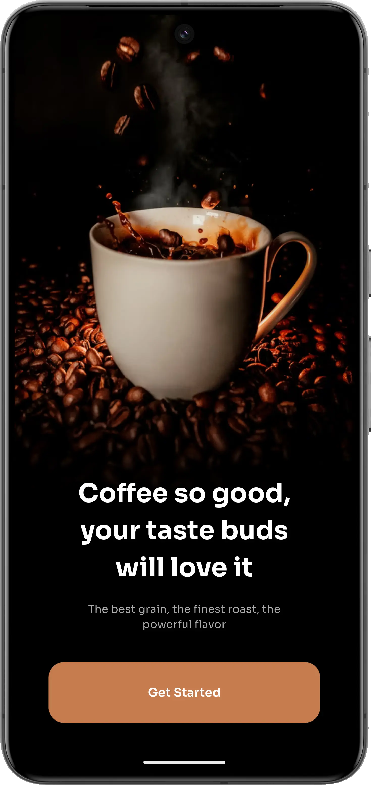
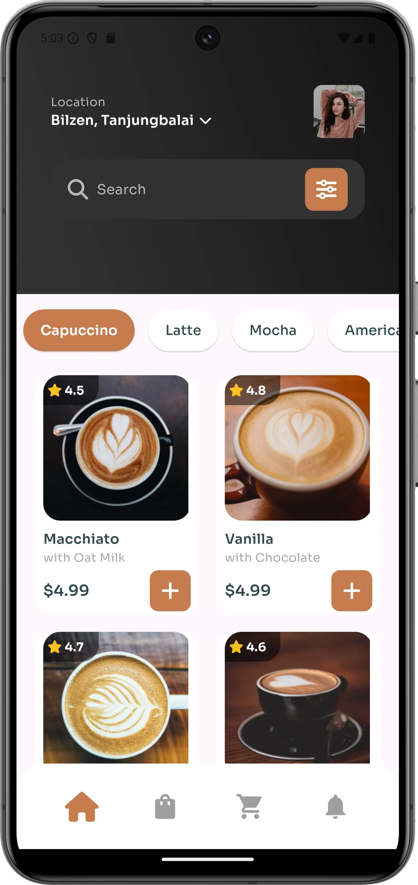
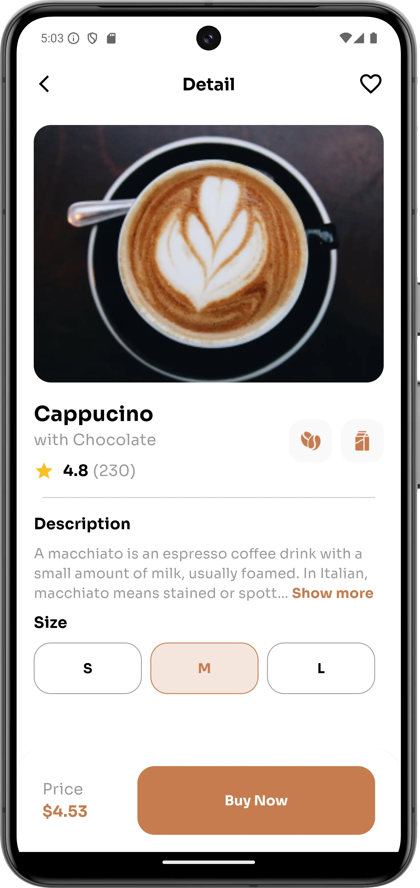
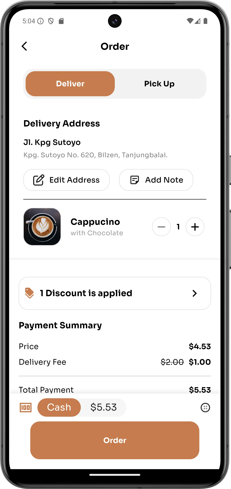
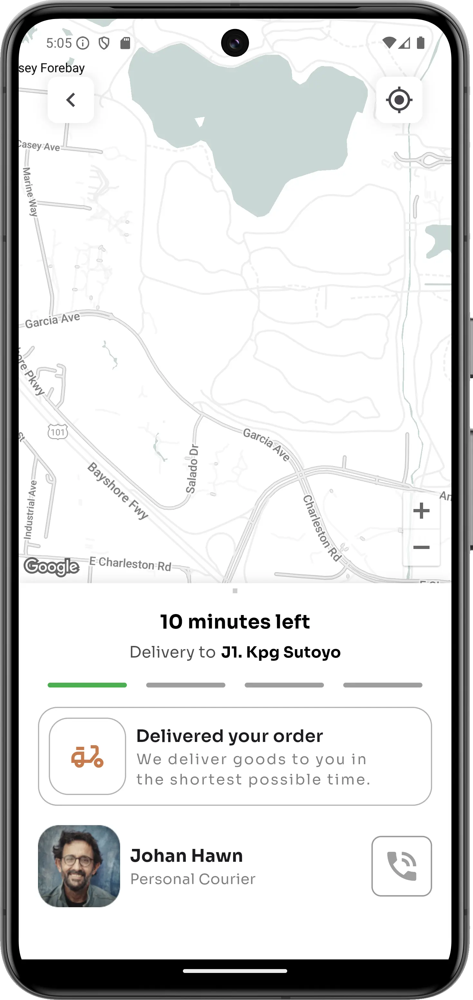

# Coffee Shop App

Welcome to the Coffee Shop App! This Flutter application is designed to provide a seamless coffee
ordering experience. The app features a beautiful UI, a variety of coffee types, and Google Maps
integration to help you find the nearest coffee shop. This is just a frontend implementation of a
figma UI file

## Figma Design

The original UI design was created using Figma. You can view the
design [here](https://www.figma.com/design/7tAjzzHmFsGRbOY46OkGuS/Coffee-Shop-Mobile-App-Design-(Community)?node-id=2-2&t=JGxhEhZKlfGpn0aI-1).

## Features

- Browse different types of coffee
- Search for your favorite coffee
- View coffee details and prices
- Google Maps integration to locate nearby coffee shops

## Screenshots

Screenshots of the Coffee Shop App:

<div style="display: flex; justify-content: space-around; margin-top: 20px;">

  <!-- Screenshot 1 -->
  

  <!-- Screenshot 2 -->
  

  <!-- Screenshot 3 -->
  

  <!-- Screenshot 4 -->
  

  <!-- Screenshot 5 -->
  

</div>

## Installation

To get started with the Coffee Shop App, follow these steps:

1. **Clone the repository:**

    ```sh
    git clone https://github.com/Esfokom/coffee_shop.git
    cd coffee_shop
    ```

2. **Install Flutter:**

   If you haven't already, install Flutter by following the instructions on
   the [official Flutter website](https://flutter.dev/docs/get-started/install).

3. **Install dependencies:**

    ```sh
    flutter pub get
    ```

4. **Run the app:**

   Connect your device or start an emulator, then run:

    ```sh
    flutter run
    ```

## Contributing

We welcome contributions! Please fork the repository and submit a pull request with your changes.

## License

This project is licensed under the MIT License. See the [LICENSE](LICENSE) file for details.